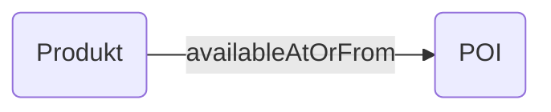

---
tags:
  - property
hide:
  - navigation
---

# availableAtOrFrom
[https://schema.org/availableAtOrFrom](https://schema.org/availableAtOrFrom)

Verknüpfung

## Definition
Dieses Attribut wird verwendet, um anzugeben, wo ein Produkt oder eine Dienstleistung verfügbar ist. Es kann sich um eine physische Adresse, eine URL oder einen anderen Ort handeln, an dem das Produkt oder die Dienstleistung erworben werden kann.

## Beispiele

### Produkt


``` json
{
  "@context": "https://schema.org",
  "@type": "Offer",
  "name": "Tagespass",
  "price": "20.00",
  "priceCurrency": "CHF",
  "availableAtOrFrom": {
    "@type": "Place",
    "name": "Freizeitpark Berg",
    "address": {
      "@type": "PostalAddress",
      "streetAddress": "Hauptstrasse 1",
      "addressLocality": "Berg",
      "addressRegion": "SG",
      "postalCode": "9305",
      "addressCountry": "CH"
    }
  }
}

```

### Produkt + Gästekarte

[](https://mermaid.ai/live/edit#pako:eNpVT8tOhEAQ_JVJn3YTlvAaYOZgIho9aLIXT2YuLTQLERgyDEZl92_8E3_MgcMm3rqqUo9eoNQVgYSTwbFhL4UaGDvWNZmdgkeDtp3YEzrMdhu7V7Bnh8MNO-MHth2-dXRrj-bB6P7MnnWJXTFP7UDT5PzF70_5ToZatvsnrSHgucq2AlljN5EHPZkeVwzLOkGBbagnBdKdFdU4d1aBGi7ON-LwqnUP0prZOY2eT801Zx4rtHTfonuov7KGhorMnZ4HCzINwi0E5AKfIEMR-1nIeRwHPBd5ECUefIGMstRPQ5EnMU-ySCQXD7631sDnQSxyIUTCIy4CJ_0BA4NmRA)

## Ähnliche Verknüpfungen

[areaServed](/schemaArchiv/areaServed)

## Hinweise

!!! info "Hinweis"
    Bei Gästekarten discover.swiss wird areaServed statt availableAtOrFrom für die Verknüpfung der Produkte mit einem POI verwendet.
    https://docs.discover.swiss/dev/concepts/offers/