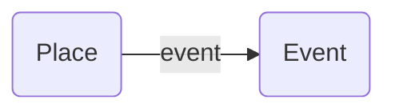

---
tags:
  - property
hide:
  - navigation
---
# event
property

[https://schema.org/event](https://schema.org/event)

## Definition
Bevorstehende oder vergangene Veranstaltung im Zusammenhang mit diesem [Ort](Place), dieser [Organisation](Organization) oder dieser Aktion.

## Beispiele

### Graph

### JSON-LD
``` json
{
    "@context": "https://schema.org",
    "@type": "TouristAttraction",
    "name": "Musée Marmottan Monet",
    "description": "It's a museum of Impressionism and french ninenteeth art.",
    "event": {
        "@type": "Event",
        "about": ["Hodler","Monet","Munch"],
        "name": "Peindre l'impossible",
        "startDate": "2016-09-15",
        "endDate": "2017-01-22"
    }
}
```

## Ähnliche Verknüpfungen

[location](/schemaArchiv/location)


