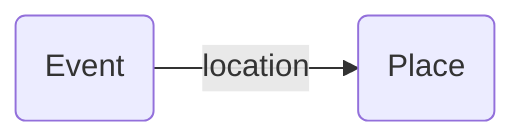

---
tags:
  - property
hide:
  - navigation
---
# location
property

[https://schema.org/location](https://schema.org/location)


Verknüpfung und Attribut im contentdesk.io.

## Definition
Der Ort, an dem beispielsweise eine Veranstaltung stattfindet, eine Organisation ihren Sitz hat oder eine Handlung stattfindet.

## Beispiele

### Graph

### JSON-LD
``` json
{
  "@context": "https://schema.org",
  "@type": "Event",
  "name": "Miami Heat at Philadelphia 76ers - Game 3 (Home Game 1)",
  "location": {
    "@type": "Place",
    "address": {
      "@type": "PostalAddress",
      "addressLocality": "Philadelphia",
      "addressRegion": "PA"
    },
    "url": "wells-fargo-center.html"
  },
  "offers": {
    "@type": "AggregateOffer",
    "priceCurrency": "USD",
    "lowPrice": "35",
    "offerCount": "1938"
  },
  "startDate": "2016-04-21T20:00",
  "url": "nba-miami-philidelphia-game3.html"
}
```

## Ähnliche Verknüpfungen

[event](/schemaArchiv/event)


### Used

| Provider                    | Used     | Bemerkung |
| ---------                   | -------- | --------- |
| Schema.org                  | ✅       |           | 
| Contentdesk                 | ✅       |           | 
| discover.swiss              | ✅       |           | 
| Outdooractive               | ❌       | ?          | 
| [Guidle](../connect/guidle) | ❌       | Nutzt `address` siehe Dokumentaton | 
| OpenStreetMap               | ❌       | Verknüpft keine Events mit Locations |